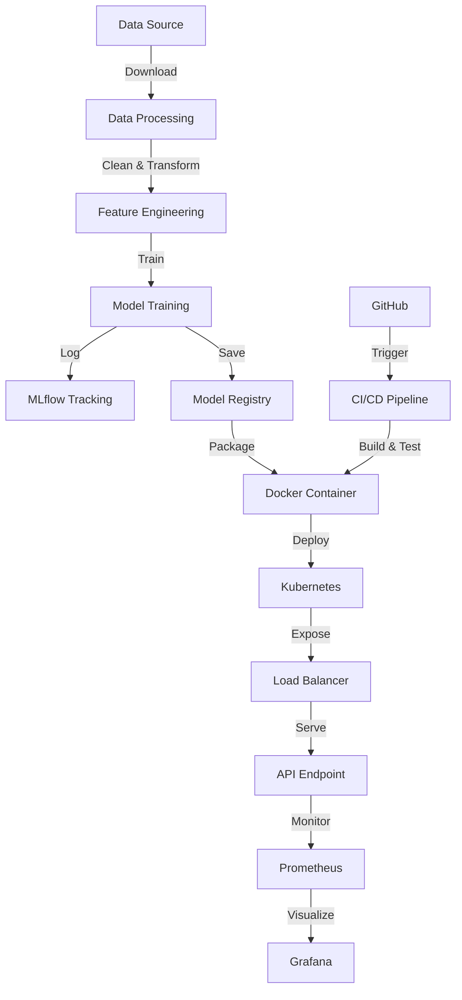

# Heart Disease Prediction - MLOps Project

This project implements a production-ready MLOps pipeline for heart disease risk classification, featuring experiment tracking, containerization, and Kubernetes orchestration.

# Architechture Diagram




# Project Structure
```
heart-disease-mlops/
│
├── data/
│   ├── raw/                          # Raw dataset
│   ├── processed/                    # Processed data
│   └── download_data.py              # Script to download dataset
│
├── notebooks/
│   ├── 01_eda.ipynb                  # Exploratory Data Analysis
│   ├── 02_feature_engineering.ipynb  # Feature engineering experiments
│   └── 03_model_training.ipynb       # Model training experiments
│
├── src/
│   ├── __init__.py
│   ├── config.py                     # Configuration management
│   ├── data/
│   │   ├── __init__.py
│   │   ├── data_loader.py            # Data loading utilities
│   │   └── preprocessing.py          # Data preprocessing pipeline
│   ├── features/
│   │   ├── __init__.py
│   │   └── feature_engineering.py    # Feature transformation
│   ├── models/
│   │   ├── __init__.py
│   │   ├── train.py                  # Model training
│   │   ├── predict.py                # Model prediction
│   │   └── evaluate.py               # Model evaluation
│   └── utils/
│       ├── __init__.py
│       └── logger.py                 # Logging utilities
│
├── api/
│   ├── __init__.py
│   ├── app.py                        # FastAPI application
│   └── schemas.py                    # Pydantic models for API
│
├── tests/
│   ├── __init__.py
│   ├── test_data_preprocessing.py    # Data processing tests
│   ├── test_model.py                 # Model tests
│   └── test_api.py                   # API tests
│
├── mlruns/                           # MLflow tracking directory
│
├── models/                           # Saved models
│   └── .gitkeep
│
├── deployment/
│   ├── kubernetes/
│   │   ├── deployment.yaml           # K8s deployment
│   │   ├── service.yaml              # K8s service
│   │   └── ingress.yaml              # K8s ingress
│   ├── helm/
│   │   └── heart-disease-chart/      # Helm chart
│   └── docker-compose.yml            # Local deployment
│
├── monitoring/
│   ├── prometheus.yml                # Prometheus config
│   └── grafana-dashboard.json        # Grafana dashboard
│
├── .github/
│   └── workflows/
│       └── ci-cd.yml                 # GitHub Actions pipeline
│
├── scripts/
│   ├── train_model.py                # Training script
│   ├── test_api.sh                   # API testing script
│   └── build_docker.sh               # Docker build script
│
├── screenshots/                      # Screenshots for report
│
├── Dockerfile                        # Docker configuration
├── docker-compose.yml                # Docker Compose setup
├── requirements.txt                  # Python dependencies
├── setup.py                          # Package setup
├── .env.example                      # Environment variables template
├── .gitignore                        # Git ignore rules
├── .dockerignore                     # Docker ignore rules
├── pytest.ini                        # Pytest configuration
├── README.md                         # Project documentation
└── REPORT.md                         # Assignment report
```

## 🚀 Quick Start (Local Development)

1. **Environment Setup**:
```bash
python -m venv venv
source venv/bin/activate  # Windows: venv\Scripts\activate
pip install -r requirements.txt

```


2. **Data & Training**:
```bash
python data/download_data.py
python scripts/train_model.py

```


*Note: View training logs and metrics via `mlflow ui`.*
3. **Run API**:
```bash
uvicorn api.app:app --host 0.0.0.0 --port 8000

```

4. Initialize Dashboards
Run the load generation script to send 500 randomized requests to the API. This simulates real-world usage and populates the Prometheus metrics.

```bash
# Ensure your API is accessible at localhost:8000
# (via uvicorn, docker-compose, or kubectl port-forward)

chmod +x scripts/generate_traffic.sh
./scripts/generate_traffic.sh
```

---

## 🐳 Containerization & Monitoring

To run the full stack (API + Prometheus + Grafana) using Docker:

```bash
docker-compose up --build -d

```

* **API**: http://localhost:8000
* **Prometheus**: http://localhost:9090
* **Grafana**: http://localhost:3000 (Credentials: `admin`/`admin`)

**Initialize Dashboards**
Run the load generation script to send 500 randomized requests to the API. This simulates real-world usage and populates the Prometheus metrics.

```bash
# Ensure your API is accessible at localhost:8000
# (via uvicorn, docker-compose, or kubectl port-forward)

chmod +x scripts/generate_traffic.sh
./scripts/generate_traffic.sh
```

---

## ☸️ Kubernetes Deployment (Minikube)

To deploy the production-grade manifest with Horizontal Pod Autoscaling (HPA):

1. **Start Cluster & Point Docker Shell**:
```bash
minikube start
eval $(minikube docker-env)

```


2. **Build Image Locally**:
```bash
docker build -t heart-disease-api:latest .

```


3. **Deploy Manifests**:
```bash
kubectl apply -f deployment/kubernetes/deployment.yaml

```


4. **Access the API**:
```bash
kubectl port-forward service/heart-disease-api-service 8000:80

```

5. Initialize Dashboards
Run the load generation script to send 500 randomized requests to the API. This simulates real-world usage and populates the Prometheus metrics.

```bash
# Ensure your API is accessible at localhost:8000
# (via uvicorn, docker-compose, or kubectl port-forward)

chmod +x scripts/generate_traffic.sh
./scripts/generate_traffic.sh
```


---

## 🧪 Testing & Validation

Run the suite of unit tests for preprocessing and API endpoints:

```bash
pytest tests/

```

To simulate production load and verify the HPA/Monitoring:

```bash
chmod +x scripts/generate_traffic.sh
./scripts/generate_traffic.sh

```

---

## 📊 Project Artifacts

* **Model Registry**: MLflow tracking for LR and Random Forest models.
* **Infrastructure**: Kubernetes Deployment with Liveness/Readiness probes.
* **Metrics**: Custom Prometheus exporters for model drift and prediction confidence.

