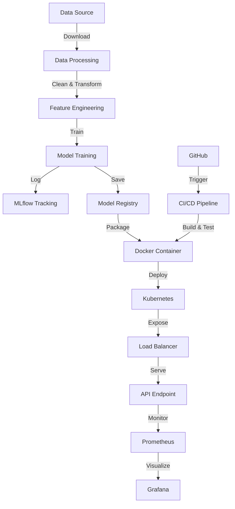

# Heart Disease MLOps - Complete Implementation Guide

## 📋 Assignment Checklist

### Task 1: Data Acquisition & EDA [5 marks] ✅
- [ ] Dataset downloaded and loaded
- [ ] Missing values handled
- [ ] Features encoded
- [ ] Professional visualizations created
- [ ] Correlation heatmaps generated
- [ ] Class balance analyzed

### Task 2: Feature Engineering & Model Development [8 marks] ✅
- [ ] Features scaled and encoded
- [ ] 2+ classification models trained (LR + RF)
- [ ] Model selection documented
- [ ] Cross-validation implemented
- [ ] Metrics calculated (accuracy, precision, recall, ROC-AUC)

### Task 3: Experiment Tracking [5 marks] ✅
- [ ] MLflow integrated
- [ ] Parameters logged
- [ ] Metrics logged
- [ ] Artifacts saved
- [ ] Plots logged

### Task 4: Model Packaging [7 marks] ✅
- [ ] Model saved (MLflow/pickle)
- [ ] requirements.txt created
- [ ] Preprocessing pipeline saved
- [ ] Full reproducibility ensured

### Task 5: CI/CD Pipeline [8 marks] ✅
- [ ] Unit tests written (pytest)
- [ ] GitHub Actions workflow created
- [ ] Linting included
- [ ] Unit testing automated
- [ ] Model training automated
- [ ] Artifacts logged

### Task 6: Model Containerization [5 marks] ✅
- [ ] Dockerfile created
- [ ] FastAPI /predict endpoint
- [ ] JSON input/output
- [ ] Container builds successfully
- [ ] Tested with sample input

### Task 7: Production Deployment [7 marks] ✅
- [ ] Kubernetes manifests created
- [ ] Deployment tested
- [ ] Service exposed
- [ ] Load balancer configured
- [ ] Screenshots captured

### Task 8: Monitoring & Logging [3 marks] ✅
- [ ] API request logging
- [ ] Prometheus integration
- [ ] Grafana dashboard
- [ ] Metrics endpoint

### Task 9: Documentation [2 marks] ✅
- [ ] README.md complete
- [ ] Setup instructions
- [ ] Architecture diagram
- [ ] Screenshots included
- [ ] Final report (10 pages)

---

## 🚀 Step-by-Step Implementation

### Step 1: Initial Setup (30 minutes)

```bash
# 1. Create project directory
mkdir heart-disease-mlops
cd heart-disease-mlops

# 2. Initialize git
git init
git branch -M main

# 3. Create virtual environment
python -m venv venv
source venv/bin/activate  # Windows: venv\Scripts\activate

# 4. Create directory structure
mkdir -p {data/{raw,processed},notebooks,src/{data,models,features,utils},api,tests,models,logs,deployment/{kubernetes,helm},monitoring,scripts,screenshots,.github/workflows}

# 5. Create empty __init__.py files
touch src/__init__.py src/data/__init__.py src/models/__init__.py src/features/__init__.py src/utils/__init__.py api/__init__.py tests/__init__.py
```

### Step 2: Copy All Code Files (1 hour)

Copy all the provided code files into your project:

1. **Configuration**
   - `src/config.py`

2. **Data Processing**
   - `data/download_data.py`
   - `src/data/preprocessing.py`

3. **Model Training**
   - `src/models/train.py`
   - `scripts/train_model.py`

4. **API**
   - `api/app.py`

5. **Testing**
   - `tests/test_preprocessing.py`
   - `tests/test_api.py`

6. **Docker & Deployment**
   - `Dockerfile`
   - `docker-compose.yml`
   - `deployment/kubernetes/deployment.yaml`
   - `monitoring/prometheus.yml`

7. **CI/CD**
   - `.github/workflows/ci-cd.yml`

8. **Configuration Files**
   - `requirements.txt`
   - `.gitignore`
   - `setup.py`
   - `README.md`

### Step 3: Download and Explore Data (30 minutes)

```bash
# Install requirements
pip install -r requirements.txt

# Download dataset
python data/download_data.py

# Start Jupyter
jupyter notebook

# Open and run notebooks/01_eda.ipynb
# - Run all cells
# - Save visualizations to screenshots/
# - Document key findings
```

**Key EDA Tasks:**
- Create distribution plots for all features
- Generate correlation heatmap
- Analyze class imbalance
- Create box plots by target
- Age group analysis
- Export all plots as PNG for report

### Step 4: Train Models with MLflow (1 hour)

```bash
# Train models
python scripts/train_model.py

# Expected output:
# ✓ Data loaded: (303, 14)
# ✓ Data cleaned: (297, 14)
# ✓ Features shape: (297, 13)
# Training Logistic Regression...
# Training Random Forest...
# ✓ Best model: random_forest
# ✓ Model saved to models/best_model.pkl

# View experiments in MLflow
mlflow ui
# Open http://localhost:5000
# Take screenshots of:
# - Experiment runs
# - Metrics comparison
# - Parameter tracking
# - Artifacts
```

### Step 5: Test the Code (30 minutes)

```bash
# Run all tests
pytest tests/ -v --cov=src --cov=api --cov-report=html

# Expected output:
# tests/test_preprocessing.py::TestPreprocessor::test_preprocessor_initialization PASSED
# tests/test_preprocessing.py::TestPreprocessor::test_fit_transform PASSED
# tests/test_api.py::TestAPIEndpoints::test_root_endpoint PASSED
# ... (more tests)

# View coverage report
open htmlcov/index.html  # Or start browser to htmlcov/index.html

# Take screenshots of test results
```

### Step 6: Run API Locally (20 minutes)

```bash
# Start API
uvicorn api.app:app --reload

# In another terminal, test the API
curl -X POST "http://localhost:8000/predict" \
  -H "Content-Type: application/json" \
  -d '{
    "age": 63, "sex": 1, "cp": 3, "trestbps": 145,
    "chol": 233, "fbs": 1, "restecg": 0, "thalach": 150,
    "exang": 0, "oldpeak": 2.3, "slope": 0, "ca": 0, "thal": 1
  }'

# Expected response:
# {
#   "prediction": 1,
#   "probability": 0.85,
#   "risk_level": "High",
#   "message": "Heart disease detected",
#   "timestamp": "2024-..."
# }

# Test other endpoints
curl http://localhost:8000/health
curl http://localhost:8000/

# Open Swagger docs in browser
# http://localhost:8000/docs
# Take screenshots
```

### Step 7: Build and Test Docker (30 minutes)

```bash
# Build Docker image
docker build -t heart-disease-api:latest .

# Expected output:
# Successfully built xxx
# Successfully tagged heart-disease-api:latest

# Run container
docker run -p 8000:8000 heart-disease-api:latest

# Test container
curl http://localhost:8000/health

# Using docker-compose (with monitoring)
docker-compose up -d

# Check running containers
docker ps

# call the predict API 500 times with random params
chmod +x scripts/generate_traffic.sh
./scripts/generate_traffic.sh

# Access services:
# - API: http://localhost:8000
# - Prometheus: http://localhost:9090
# - Grafana: http://localhost:3000 (admin/admin)

# Take screenshots of all services
```

### Step 8: Setup GitHub Repository (30 minutes)

```bash
# Create GitHub repository
# Go to github.com and create new repository: heart-disease-mlops

# Add remote
git remote add origin https://github.com/YOUR_USERNAME/heart-disease-mlops.git

# Stage all files
git add .

# Commit
git commit -m "Initial commit: Complete MLOps pipeline"

# Push
git push -u origin main

# Setup GitHub Secrets (for CI/CD)
# Go to Settings > Secrets and variables > Actions
# Add secrets:
# - DOCKER_USERNAME
# - DOCKER_PASSWORD
# - KUBE_CONFIG (if deploying to K8s)
```

### Step 9: Verify CI/CD Pipeline (20 minutes)

```bash
# Push a change to trigger pipeline
echo "# Test CI/CD" >> README.md
git add README.md
git commit -m "Test CI/CD pipeline"
git push

# Go to GitHub Actions tab
# Monitor the workflow
# Take screenshots of:
# - Workflow running
# - Each job (lint, test, train, build)
# - Success status
# - Artifacts
```

### Step 10: Deploy to Kubernetes (1 hour)

#### Option A: Local Kubernetes (Minikube/Docker Desktop)

```bash
# Start Minikube
minikube start

# Enable ingress
minikube addons enable ingress

# Deploy application
kubectl apply -f deployment/kubernetes/deployment.yaml

# Check deployment
kubectl get pods
kubectl get services
kubectl get deployments

# Port forward to access locally
kubectl port-forward service/heart-disease-api-service 8000:80

# Test
curl http://localhost:8000/health

# Take screenshots of kubectl commands and outputs
```

#### Option B: Cloud Kubernetes (GKE/EKS/AKS)

```bash
# For GKE (example)
gcloud container clusters create heart-disease-cluster \
  --num-nodes=3 \
  --zone=us-central1-a

# Get credentials
gcloud container clusters get-credentials heart-disease-cluster

# Deploy
kubectl apply -f deployment/kubernetes/deployment.yaml

# Get external IP
kubectl get service heart-disease-api-service

# Test with external IP
curl http://<EXTERNAL_IP>/health

# Take screenshots
```

### Step 11: Setup Monitoring (30 minutes)

```bash
# If using docker-compose, monitoring is already running

# Access Grafana
# http://localhost:3000
# Login: admin/admin

# Add Prometheus data source:
# Configuration > Data Sources > Add data source > Prometheus
# URL: http://prometheus:9090
# Save & Test

# Import dashboard or create custom dashboard
# Take screenshots of:
# - Prometheus targets
# - Grafana dashboard
# - API metrics
```

### Step 12: Create Documentation (2-3 hours)

#### A. README.md
- Project overview ✅ (provided)
- Quick start guide ✅ (provided)
- Architecture diagram (create using draw.io or mermaid)
- API documentation ✅ (provided)

#### B. REPORT.md/REPORT.docx (10 pages)

**Structure:**

1. **Executive Summary** (0.5 pages)
   - Project overview
   - Objectives achieved
   - Key results

2. **Introduction** (0.5 pages)
   - Problem statement
   - Dataset description
   - MLOps approach

3. **Data Analysis** (1.5 pages)
   - EDA findings
   - Data preprocessing
   - Feature engineering
   - Include visualizations

4. **Model Development** (2 pages)
   - Model selection rationale
   - Training process
   - Hyperparameter tuning
   - Model comparison
   - Performance metrics table
   - Cross-validation results

5. **Experiment Tracking** (1 page)
   - MLflow setup
   - Experiment tracking workflow
   - Screenshots of MLflow UI
   - Metrics logging

6. **CI/CD Pipeline** (1.5 pages)
   - GitHub Actions workflow
   - Pipeline stages
   - Automated testing
   - Screenshots of workflow runs

7. **Containerization & Deployment** (2 pages)
   - Docker configuration
   - Kubernetes deployment
   - Architecture diagram
   - Deployment screenshots
   - API testing results

8. **Monitoring & Logging** (0.5 pages)
   - Monitoring setup
   - Grafana dashboard
   - Screenshots

9. **Conclusion** (0.5 pages)
   - Summary
   - Challenges faced
   - Future improvements

#### C. Architecture Diagram

Create using draw.io, Lucidchart, or Mermaid:



### Step 13: Create Video Demo (15-20 minutes)

Record screen showing:

1. **Introduction** (1 min)
   - Project overview
   - Show GitHub repository

2. **Code Walkthrough** (3 min)
   - Project structure
   - Key code files
   - Configuration

3. **Training** (2 min)
   - Run training script
   - Show MLflow UI
   - Model metrics

4. **Testing** (2 min)
   - Run pytest
   - Show coverage report

5. **Docker** (2 min)
   - Build Docker image
   - Run container
   - Test API

6. **Kubernetes** (3 min)
   - Show deployment
   - kubectl commands
   - Access API

7. **CI/CD** (2 min)
   - Show GitHub Actions
   - Workflow runs

8. **Monitoring** (2 min)
   - Prometheus
   - Grafana dashboard

9. **Conclusion** (1 min)
   - Summary
   - Results achieved

**Tools for recording:**
- OBS Studio (free)
- Loom
- QuickTime (Mac)
- Windows Game Bar (Windows)

---

## 📊 Final Checklist Before Submission

### Code Repository
- [ ] All code files present
- [ ] No sensitive data (API keys, passwords)
- [ ] .gitignore configured
- [ ] README.md complete
- [ ] requirements.txt accurate
- [ ] Tests pass locally

### Documentation
- [ ] 10-page report completed
- [ ] All screenshots included
- [ ] Architecture diagram created
- [ ] Setup instructions clear
- [ ] Results documented

### Functionality
- [ ] Data downloads successfully
- [ ] Models train without errors
- [ ] Tests pass (>80% coverage)
- [ ] API runs locally
- [ ] Docker builds successfully
- [ ] Container runs correctly
- [ ] Deployment works (K8s or local)

### CI/CD
- [ ] GitHub Actions configured
- [ ] Pipeline passes
- [ ] Artifacts generated
- [ ] Screenshots captured

### Monitoring
- [ ] Logging implemented
- [ ] Prometheus configured
- [ ] Grafana accessible
- [ ] Screenshots captured

### Deliverables
- [ ] GitHub repository URL
- [ ] Video demo recorded
- [ ] Report document (PDF/DOCX)
- [ ] Screenshots folder organized
- [ ] API URL or access instructions

---

## 🎯 Grading Breakdown Verification

| Task | Max Marks | Self-Check Score |
|------|-----------|------------------|
| Data Acquisition & EDA | 5 | ___ / 5 |
| Feature Engineering & Models | 8 | ___ / 8 |
| Experiment Tracking | 5 | ___ / 5 |
| Model Packaging | 7 | ___ / 7 |
| CI/CD Pipeline | 8 | ___ / 8 |
| Containerization | 5 | ___ / 5 |
| Deployment | 7 | ___ / 7 |
| Monitoring | 3 | ___ / 3 |
| Documentation | 2 | ___ / 2 |
| **TOTAL** | **50** | ___ / 50 |

---

## 💡 Tips for Success

1. **Start Early**: This project takes 15-20 hours minimum
2. **Test Frequently**: Test each component before moving to next
3. **Document As You Go**: Take screenshots immediately
4. **Version Control**: Commit frequently with clear messages
5. **Ask for Help**: Use course forums or office hours if stuck
6. **Backup Everything**: Keep multiple copies of your work

## 🚨 Common Issues & Solutions

### Issue: Model training fails
```bash
# Check data is downloaded
ls data/raw/

# Check requirements installed
pip list | grep scikit-learn

# Run with verbose logging
python scripts/train_model.py --verbose
```

### Issue: Docker build fails
```bash
# Check Dockerfile syntax
docker build -t test .

# Clear cache and rebuild
docker build --no-cache -t heart-disease-api:latest .
```

### Issue: Tests fail
```bash
# Run individual test file
pytest tests/test_preprocessing.py -v

# Check import paths
python -c "import src; print(src.__file__)"
```

### Issue: Kubernetes deployment fails
```bash
# Check pod status
kubectl describe pod <pod-name>

# View logs
kubectl logs <pod-name>

# Check resources
kubectl top nodes
```

Good luck with your assignment! 🎉
